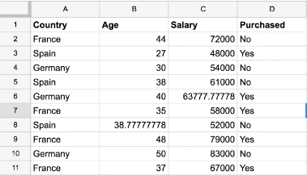

# Data Handling - ETL, EDA, and Preprocessing

Data handling includes reading, understanding, cleaning, transforming, pre-processing and loading data.


**How to do EDA?**

When doing data analysis EDA is step 1. EDA is done to understand your data as much as possible. It make yor familiar with data distribution, data variables and relation of variables. This guide is like a pseudo-code for doing EDA. So let's get started with..

**What is Exploratory Data Analysis?**

It is the very first step in analysis of the dataset. It is the step to prepare data before applying any model. 

But before EDA, one should spend time in really **understanding the problem**, as in why one needs to do EDA. Once you are clear with the problem statement you can relate the data to solution while doing EDA.

Find the **key variable** that is required to solve the problem. For e.g., in titanic data set it is 'survived'. In house price data set it is 'Sales Price'. Then begin with univariate analysis on thsi data variable.

Find relation of key variable with other variables, this is bivariate analysis.

Once, this is done, try to handle outliers and missing values.

It can include many steps as follow:


## Analyzing Dataset - Data Understanding

Look at the metadata of the variables. What variables are available. what information do they hold. what data type they have. brief stats around those data variables. We can use following commands:

```py
df.head()
df.info()
df.descibe()
```

**Analyze key component**

In this section, use statistics and visualization to analyze one (or more) of the variable from the data set. For eg, sales price. Use `df['col'].describe()` to see stats output.

Find **distribution** of the key component by plotting a `distplot()` or histogram. Here, we can see if it is normally distributed or skewed.

**Analyze relation of Key component with other Variables**

We now analyze key component variable with respect to other numerical variables availabe in the dataset. To do this we can make `scatterplot()` between two different variables. This will show us the relation between them. Linear relation or not. Positive or negative.. etc.

To analyze categorical variables use `boxplot()`.

**Finding Correlation**

Use `.corr()` to find correlation between all variables. THen use `heatmap()` to plot the correlations. Find which varables have strong correlation.

Find fields of interest, then make a zoomed heatmap to further analyze variables or remove variables which are not of use.

Once we ahve found variables that have good relation with key variable we can create a `pairplot()` of the columns of interest to compare how they relate with each other.

Now that we have found data variables that make sense and how they are related, we can think about further cleaning the data, like handling missing values and outliers.

## Data Preprocessing

Steps reuquired to clean and build data ready for machine learning. Sample dataset:



### Missing Data

We can use `isnull()` to find missing values. Find total number of missing values and % of missing values for each column.

Consider how much impact missing values will have on analysis. If the columns having missing values are not the ones of our interest, drop the columns. If total missing values are very small compred to number of records, simply you may drop one or few rows.

- you can remove if you don't have crucial info and have lot of data
- replace by mean of column

```py
from sklearn.preprocessing import Imputer

imputer = Imputer(missing_values = 'NaN', strategy = 'mean', axis=0)
# Imputer is class, imputer is obj

imputer = imputer.fit(df['age','salary']) 
# we pass matrix from df, it is two columsn with numbers. 
# we get fitted object imputer, fitted to our matrix

df['age','salary'] = imputer.transform(df['age','salary'])
```

### Categorical Variables

ML models can only take numbers in mathematical eqns. So encode to numbers. eg, country, boolean (yes/no).

For comparable and booleans use `LabelEncoder`, it gives numbers for categories.

```py
from sklearn.preprocessing import LabelEncoder

labelEncoder_y = LabelEncoder()
df['y'] = labelEncoder_y.fit_transform(df['y']) 
# fits transforms and returns encoded values, a vector y
```

For non-comparable categories, like country, use `OneHotEncoder`. It makes `dummy_variables` with each country having its own column.

Now numbers are comparable so country with 2 will be treated greater than 1, but this doesn;t make sense so we will use dummy_variables. So we have new columns equal to number of categories. so we will have column for each country and it will ahve 0 or 1 depending on its presence. for this we use:

```py
from sklearn.preprocessing import OneHotEncoder
oneHotEncoder = OneHotEncoder(categorical_features = [0]) 
# index of categorical variable

df = oneHotEncoder.fit_transform(X).to_array()
```

### Train Test Validation Split

We need to divide the data in to train and test so that our model does not learn the correlation by heart and can fit new data which is slightly different from train. We need to be efficient in making the split so we use library. `cross_validation` library is used for this.

```py
from sklearn.cross_validation import train_test_split

# X are matrix of observations. y is dependent variable.
X_train, X_test, y_train, y_test  = train_test_split(X, y, test_size = 0.2, random_state = 0) 
# random_state is used to get same split everytime.
```

### Feature Scaling

Our observations can be at different scales, eg, age ranges 20-60 and salary ranges 40k-90k. Our ML model depends mostly on euclidean dist, 

$$ P_1 (x_1, y_1) and P_2 (x_2, y_2) $$

$$ dist = \sqrt{(x_1-x_2)^2 + (y_1-y_2)^2} $$

ML model computes dist between two rows to use a model. so difference of square can be dominated by var having much range, salary in this case. Hence we need to scale variables. Other ML model which do not depend on eucledian dist like decision trees that will converge fast. ML model will run faster.

Scaling:

$$x_{standard} = \frac{x-\mu}{\sigma} $$

mean and std dev

$$ x_{norm} = \frac{x-min(x)}{max(x)-min(x)} $$

This gives same range and same scale.

```python
from sklearn.preprocessing import StandardScaler
sc_X = StandardScaler()
X_train = sc_X.fit_transform(X_train)
X_test = sc_X.transform(X_test)
```
Scaling dummy variables depends on the context, if they make significant effect on model then scale them. We loose context when we scale them but may bring better accuracy.

If any data is not normally distributed then we can take log of that data considering it doesn't affect much. (this needs improvement in understanding).

> ToDo: May include PCA LDA here, in future

## Data Wrangling

[Pandas](https://pandas.pydata.org/) is a package in Python that can be used for data manipulation.

### What is Data Manipulation?

Data manipulations can be organized around six key verbs:

- arrange: order dataframe by index or variable or sort the data
- select: choose a specific variable or set of variables or select columns in data
- filter: subset a dataframe according to condition(s) in a variable(s) or select rows in data
- mutate: transform dataframe by adding new variables or add a calculated column
- group_by: create a grouped dataframe 
- summarize: reduce variable to summary variable (e.g. mean)

Here, variable is a column in data set.

We'll cover how to perform above operations on a dataset using Pandas.

#### Filter
We can filter data to get a set of rows from complete dataset. It is similar to `WHERE` clause in SQL.

### Doing same stuff using R
R is also an excellent programming language for data manipulation. `dplyr` is a package in R that can be used to perform above operations. 

**References:**

- An excellent article by Ben, [The 5 verbs of dplyr](https://teachingr.com/content/the-5-verbs-of-dplyr/the-5-verbs-of-dplyr-article.html#the_power_of_combining_verbs), can provide you more details on this.
- Another article that compares R and Python can be found [here](https://gist.github.com/conormm/fd8b1980c28dd21cfaf6975c86c74d07).
- [Comparison of Pandas with SQL](https://pandas.pydata.org/pandas-docs/version/0.23/comparison_with_sql.html)
- [Pandas docs]( https://pandas.pydata.org/pandas-docs/version/0.23/index.html) excellent details with examples.